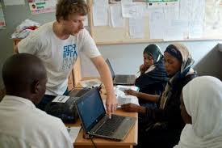

# User Personas

1. Aureli is Computer Science student who deeply wants to get job
   

<!-- a persona -->

## Their Role

- **Bio**:student
- **Needs/Goals**:wants to get job asap
- **Frustrations**: doesn't have expertise in any language
- **Scenario 1**: Student wants to get job as soon as possible and facing
  problem to find the job.

---

<!-- more personas ... -->

1. Adrien is searching for qualified applicants who can start working right
   away.

- **Bio**: HR Recruiter @Colruyt Group
- **Needs/Goals**:wants to open position immediately
- **Frustrations**: doesn't find resource available immediately to join
- **Scenario 1**: HR recruiter wants to get resource for open positions in
  Colruyt group immediately.

------------------------------------------------------------]

1. Salih is looking for volunteer opportunity where he can teach IT skills to
   others

- **Bio**: Volunteer @HYF
- **Needs/Goals**:wants to help and teach others
- **Frustrations**: doesn't flexible timings slots to achieve his goal.
- **Scenario 1**: IT person wants to share his knowledge on volunteer basis
